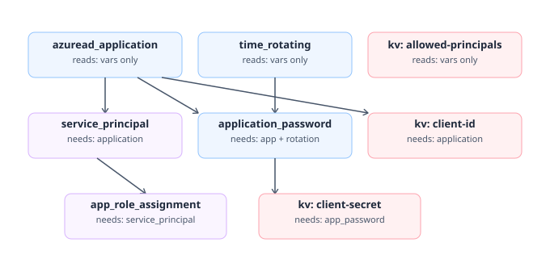
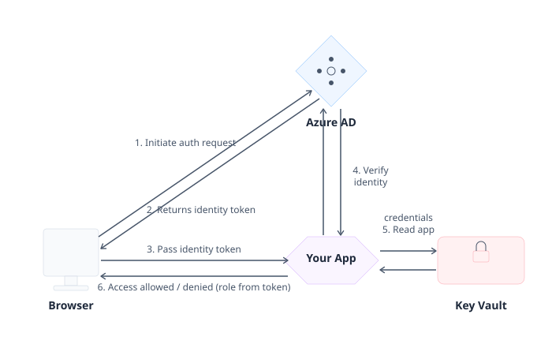

# azuread-oidc-app

> **Stop hand-creating app registrations in the Azure Portal and pasting secrets into config files.**
> Define your app's roles once in Terraform — the module handles everything else.

This Terraform module registers an app in **Microsoft Entra ID (Azure AD)**, creates its
service principal, assigns AAD groups to roles, rotates the client secret automatically,
and publishes the credentials to **Key Vault** — all in one `terraform apply`.

---

## Prerequisites

Everything below must exist before running `terraform apply`.

### Tools
| Tool | Install |
|---|---|
| Terraform >= 1.5 | https://developer.hashicorp.com/terraform/install |
| Azure CLI | https://learn.microsoft.com/cli/azure/install-azure-cli |
| kubectl | https://kubernetes.io/docs/tasks/tools/ |
| Docker | https://docs.docker.com/get-docker/ |
| minikube *(local testing only)* | https://minikube.sigs.k8s.io/docs/start/ |

### Azure login
```bash
az login
az account set --subscription "<your-subscription-id>"
```

### Azure resources to create in advance
| Resource | Why | Create command |
|---|---|---|
| **Resource group** | Container for Key Vault | `az group create --name rg-oidc-demo --location japaneast` |
| **Key Vault** | Stores the app credentials | `az keyvault create --name kv-oidc-demo --resource-group rg-oidc-demo --location japaneast` |
| **AAD group — admins** | Assigned to Admin role | `az ad group create --display-name "demo-admins" --mail-nickname "demo-admins"` |
| **AAD group — users** | Assigned to User role | `az ad group create --display-name "demo-users" --mail-nickname "demo-users"` |

### Permissions required on your account
| Permission | Where | Grant command |
|---|---|---|
| `Application.ReadWrite.All` | Entra ID | Assigned by your tenant admin |
| `Key Vault Secrets Officer` | Key Vault | `az role assignment create --role "Key Vault Secrets Officer" --assignee $(az ad signed-in-user show --query id -o tsv) --scope $(az keyvault show --name kv-oidc-demo --query id -o tsv)` |

---

## What this module creates



| Resource | What it is |
|---|---|
| **Entra ID Application** | The app registration itself, with your custom roles defined on it |
| **Service Principal** | The live tenant instance of the app (what users actually sign in to) |
| **App Role Assignments** | Binds each AAD group/user to a role (e.g. Admin, User) |
| **Client Secret** | Auto-rotates every 700 days via `time_rotating` |
| **Key Vault secrets** ⭐ | Three secrets written automatically (see below) |

### What gets published to Key Vault

| Key Vault Secret Name | Value | Used for |
|---|---|---|
| `<prefix>-client-id` | The app's client ID | Your app reads this to identify itself to Entra ID |
| `<prefix>-client-secret` | The app's client secret | Your app reads this to exchange auth codes for tokens |
| `<prefix>-allowed-principals` | Comma-separated object IDs of all assigned principals | Optional: downstream authorization checks |

> **Why Key Vault?** These are server-side secrets — they must never appear in git or container
> images. Key Vault is the secure bridge between Terraform (which creates them) and your
> running app (which needs them).

---

## How a user signs in — the full flow



```
1. User visits your app  →  app redirects to Entra ID login page
2. Entra ID authenticates the user  →  returns a JWT token (contains roles claim)
3. Browser sends the token to your app
4. App verifies the token with Entra ID   ← uses client-id + client-secret from Key Vault
5. App reads the `roles` claim from the token
6. App grants or denies access based on the role  (Admin sees more than User)
```

**Steps 1–3:** Standard browser OIDC redirect.

**Step 4:** This is where `client-id` and `client-secret` from Key Vault are used.

**Steps 5–6:** Your app reads `token["roles"]` and decides what to show. The demo app in
`usecase/consuming-secrets/flask-app/` implements this end-to-end.

> **Shortcut:** Set `require_role_to_signin = true` and Entra ID enforces step 6 for you
> users with no assigned role are blocked before they even reach your app.

---

## How it's organized

```
modules/azuread-oidc-app/               → the reusable Terraform module
usecase/provision/                       → Part 1: provision the app + roles in Entra ID
usecase/consuming-secrets/              → Part 2: get those secrets into a running pod
  ├── fetch-secrets.sh                  →   simple script (testing / no CSI driver)
  ├── secret-provider-class.yaml        →   production: CSI driver, auto-syncs on rotation
  ├── deployment.yaml                   →   Kubernetes Deployment wired to the secrets
  └── flask-app/                        →   Flask demo app that implements the OIDC flow
docs/                                    → architecture diagrams
```

---

## How to call the module

```hcl
module "my_app" {
  source = "./modules/azuread-oidc-app"

  app_display_name = "app-my-tool"
  owners           = ["<your-object-id>"]
  redirect_uris    = ["https://my-tool.example.com/auth/callback"]

  # Define the roles your app will check
  roles = [
    { name = "Admin", description = "Can manage settings" },
    { name = "User",  description = "Can use the tool" },
  ]

  # Assign AAD groups (or user object IDs) to each role
  role_assignments = {
    Admin = ["<admin-group-object-id>"]
    User  = ["<user-group-object-id>"]
  }

  # true = Entra ID blocks anyone with no role from signing in at all
  require_role_to_signin = true

  keyvault_id        = var.keyvault_id
  secret_name_prefix = "my-tool"   # KV secrets will be: my-tool-client-id, my-tool-client-secret
}
```

### Key inputs at a glance

| Input | Required | Purpose |
|---|---|---|
| `app_display_name` | ✅ | Name shown in the Entra ID portal |
| `owners` | ✅ | Who can manage this app registration |
| `redirect_uris` | ✅ | Where Entra ID redirects after login (must match your app) |
| `roles` | ✅ | Role names your app will check in the token |
| `role_assignments` | — | Which AAD groups get which role |
| `require_role_to_signin` | — | `true` = enforce roles at Entra ID level (default: `false`) |
| `keyvault_id` | ✅ | Where to write the credentials |
| `secret_name_prefix` | — | Prefix for KV secret names (default: `app_display_name`) |

---

## Usecase — step by step

### Part 1 · `usecase/provision/` — provision the app in Entra ID

This is the Terraform part. Run it once. It creates everything in Entra ID and writes
credentials to Key Vault.

```bash
cd usecase/provision
cp terraform.tfvars.example terraform.tfvars
# Edit terraform.tfvars — fill in your Key Vault ID and AAD group object IDs

terraform init
terraform plan
terraform apply
```

After apply, Key Vault contains:
```
app-my-oidc-app-client-id       ← copy this into your app config
app-my-oidc-app-client-secret   ← never put this in git
app-my-oidc-app-allowed-principals
```

---

### Part 2 · `usecase/consuming-secrets/` — get secrets into your pod

The module only *writes* to Key Vault. This part reads them back out and
injects them into a running Kubernetes pod.

**Choose one of two approaches:**

| | `fetch-secrets.sh` | `secret-provider-class.yaml` |
|---|---|---|
| How it works | `az keyvault secret show` → `kubectl create secret` | CSI driver pulls from KV automatically |
| Stays in sync when secret rotates? | ❌ Re-run manually | ✅ Automatic |
| Requires CSI driver on cluster? | No | Yes (built into AKS) |
| Good for | Local testing / minikube | Production AKS |

Both produce the same Kubernetes Secret named `oidc-app-credentials` with keys
`client-id` and `client-secret`. The pod reads them as env vars `OIDC_CLIENT_ID`
and `OIDC_CLIENT_SECRET`.

**Option A — script (quick test) on minikube:**

```bash
minikube start
kubectl get nodes

# 3. fetch the secrets from Key Vault into a plain k8s Secret (works fine on minikube)
cd usecase/consuming-secrets
./fetch-secrets.sh

#verify:
kubectl get secret oidc-app-credentials -n demo
kubectl get secret oidc-app-credentials -n demo -o json | jq -r '.data | map_values(@base64d)'

```

**Option B — CSI driver (production):**
```bash
# Edit secret-provider-class.yaml: set keyvaultName, tenantId, userAssignedIdentityID
kubectl apply -f secret-provider-class.yaml
```

---

### Part 3 · Run the demo app (step 6 — role-based access)

`usecase/consuming-secrets/flask-app/` is a small Flask app that implements the full
OIDC login flow and reads the `roles` claim from the token to grant/deny access.

```bash
# Build and push the image
docker build -t <your-registry>/oidc-demo-app:latest ./flask-app
cd usecase/consuming-secrets
docker push <your-registry>/oidc-demo-app:latest

# Create the session secret (Flask needs this to sign cookies)
kubectl create secret generic oidc-session \
  --from-literal=session-secret=$(openssl rand -hex 32)

# Edit deployment.yaml: set your image name, AZURE_TENANT_ID, and REDIRECT_URI
kubectl apply -f deployment.yaml
```

When a user visits the app:
- **Admin** → sees the admin panel
- **User** → sees standard access
- **No role** → access denied (or blocked by Entra ID if `require_role_to_signin = true`)

---

## Requirements

| Requirement | Where needed |
|---|---|
| `Application.ReadWrite.All` (or equivalent) on the Terraform identity | `usecase/provision/` |
| `Key Vault Secrets Officer` on the target Key Vault | `usecase/provision/` |
| Azure CLI logged in (`az login`) | `fetch-secrets.sh` |
| Secrets Store CSI Driver on the cluster | `secret-provider-class.yaml` |
| Docker + a container registry | `usecase/consuming-secrets/flask-app/` |
